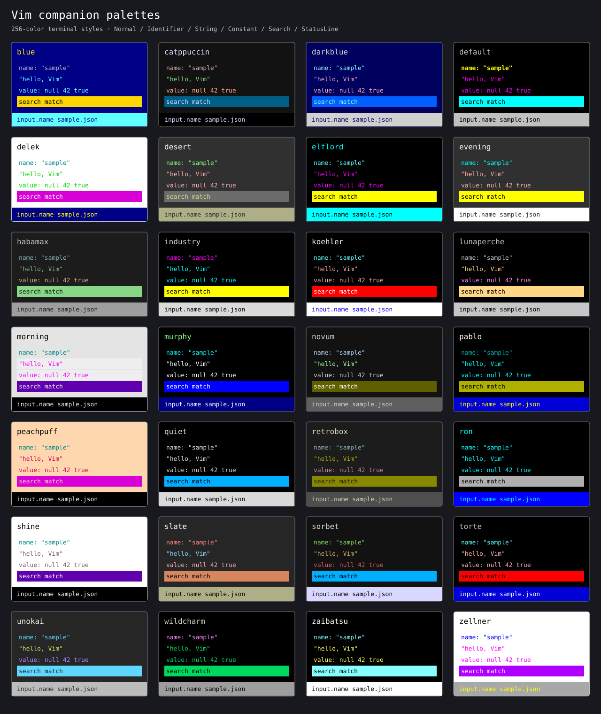

# Vim companion palettes

All 28 top-level colorscheme files in the pinned Vim runtime have a tless
companion. Build tless with `--features colorscheme`, then select a scheme
with `tless --theme <name>`.

```sh
tless --theme desert data.json
tless --theme peachpuff data.json
```



## Audit method

The source revision is `a96c3bc1f7f5ebb62643ae54ea8a1d2fa732aaf8` in
[vim/vim](https://github.com/vim/vim/tree/a96c3bc1f7f5ebb62643ae54ea8a1d2fa732aaf8/runtime/colors).
The import covers every top-level `runtime/colors/*.vim` file. Helper scripts,
color-name lists, third-party plugins, and the separate legacy colors are excluded.

A fresh Vim process loads each scheme with user configuration and viminfo
disabled, syntax enabled, `t_Co=256`, and `notermguicolors`. The initial
background is dark. Schemes that select light keep that choice. `default`
resets the background based on the host, so its companion explicitly selects
dark after loading. Dual-background schemes use their dark variant.
Catppuccin therefore uses Mocha. Alternate light variants are not separate themes.

The extractor resolves highlight links with `synIDtrans` and reads the final
cterm foreground, background, bold, reverse, and underline attributes. It does
not approximate colors from screenshots or parse only the first highlight command.
The audit records the source SHA-256, original attribution, and resolved groups
for each file. Empty attributes are omitted and mean unset or false.

Extraction uses Vim 9.1 with patches 1–1752 and the pinned runtime. Vim's
compiled-in default highlight definitions therefore come from that executable;
they are not claimed to come from the newer runtime revision. The exact host
version is recorded in the audit. Regeneration from the snapshot needs no Vim.

## Palette inventory

Numbers are xterm 256-color indices. Normal lists foreground/background.
Strings and keys list their foreground. The preview uses the standard xterm
RGB values; a terminal may customize indices 0–15.

| Vim scheme | tless option | Background | Normal | String | Key |
| --- | --- | --- | --- | --- | --- |
| blue | `blue` | dark | 220/18 | 87 | 250 |
| catppuccin | `catppuccin` | dark | 189/233 | 114 | 181 |
| darkblue | `darkblue` | dark | 252/17 | 217 | 123 |
| default | `default` | dark | 7/0 | 13 | 11 |
| delek | `delek` | light | 16/231 | 40 | 30 |
| desert | `desert` | dark | 231/236 | 217 | 120 |
| elflord | `elflord` | dark | 51/16 | 201 | 87 |
| evening | `evening` | dark | 231/236 | 217 | 51 |
| habamax | `habamax` | dark | 251/234 | 108 | 109 |
| industry | `industry` | dark | 253/16 | 51 | 201 |
| koehler | `koehler` | dark | 231/16 | 217 | 87 |
| lunaperche | `lunaperche` | dark | 251/16 | 222 | 251 |
| morning | `morning` | light | 16/254 | 201 | 30 |
| murphy | `murphy` | dark | 120/16 | 231 | 51 |
| novum | `novum` | dark | 188/233 | 157 | 153 |
| pablo | `pablo` | dark | 231/16 | 51 | 37 |
| peachpuff | `peachpuff` | light | 16/223 | 161 | 30 |
| quiet | `quiet` | dark | 253/16 | 253 | 253 |
| retrobox | `retrobox` | dark | 187/234 | 142 | 109 |
| ron | `ron` | dark | 51/16 | 51 | 51 |
| shine | `shine` | light | 16/231 | 95 | 30 |
| slate | `slate` | dark | 231/235 | 117 | 210 |
| sorbet | `sorbet` | dark | 253/233 | 179 | 113 |
| torte | `torte` | dark | 251/16 | 217 | 87 |
| unokai | `unokai` | dark | 255/235 | 185 | 81 |
| wildcharm | `wildcharm` | dark | 252/16 | 41 | 213 |
| zaibatsu | `zaibatsu` | dark | 231/16 | 227 | 123 |
| zellner | `zellner` | light | 16/231 | 201 | 21 |

## Mapping and adaptations

| tless role | Vim highlight group |
| --- | --- |
| Null | Constant |
| Boolean / number / string | Boolean / Number / String |
| Object key | Identifier |
| Empty container / delimiter / comma | Delimiter |
| Punctuation / command row / indentation | Normal |
| Array index / line number | LineNr |
| Preview text / count / ellipsis | Comment |
| Empty-row marker / truncation marker | NonText |
| Status row / path base | StatusLine |
| Information / warning / error | ModeMsg / WarningMsg / ErrorMsg |
| Focused key / array index | Visual, plus bold underline |
| Focused or paired delimiter | MatchParen, plus bold underline |
| Focused line number | CursorLineNr, plus bold underline |
| Focused truncation marker | NonText, plus bold underline |
| Search match, including previews | Search |
| Current search match | IncSearch, plus bold underline |

Search replaces the complete role/focus style. A current match inside a
collapsed preview uses ordinary Search, matching existing tless navigation.
Bold underline makes focus and the current match visible even in restrained
schemes such as Quiet. Configured color overrides apply after built-in styles,
using the existing theme keys and named 16-color values.

Unset group colors inherit Normal. When Normal itself has no explicit color,
the companion uses index 7 on 0 for dark, or 0 on 15 for light. This makes
background painting predictable. Document rows, blank rows, indentation, and
spaces after line numbers retain the scheme background. Vim companions require
a 256-color terminal with background-color erase support.

These are terminal companions. GUI RGB palettes, automatic background detection,
8/16-color fallback palettes, Vim plugins, and filetype-specific syntax overrides
are outside this mapping. None of the selected cterm groups requires italic,
undercurl, standout, or strikethrough; the importer rejects those attributes
instead of silently discarding them.

## Regeneration and checks

From the repository root, regenerate Rust from the committed snapshot:

```sh
python3 scripts/import-vim-themes.py
python3 scripts/import-vim-themes.py --check
```

To repeat extraction, check out the pinned Vim revision and pass its runtime:

```sh
python3 scripts/import-vim-themes.py --runtime /path/to/vim/runtime
```

Use the recorded Vim executable version when comparing compiled-in defaults.
The runtime path must contain the full runtime, including syntax defaults.
The importer does not download or verify a Git checkout; confirm its revision
before extraction. Per-file hashes make subsequent source comparison possible.

Validation commands:

```sh
cargo fmt --all -- --check
cargo clippy --locked --all-features -- -D warnings
cargo test --locked
cargo test --locked --all-features
python3 scripts/import-vim-themes.py --check
okf validate docs/
```

The tests check palette colors, background resets, CLI names, config precedence,
and focus/search distinctions across every companion. Original Classic/Cyan
rendering tests remain in place.

## Attribution

[Vim license](../src/theme/VIM-LICENSE),
[source attributions and palette data](../src/theme/vim-audit.json), and
[adaptation notice](../NOTICES.md).
